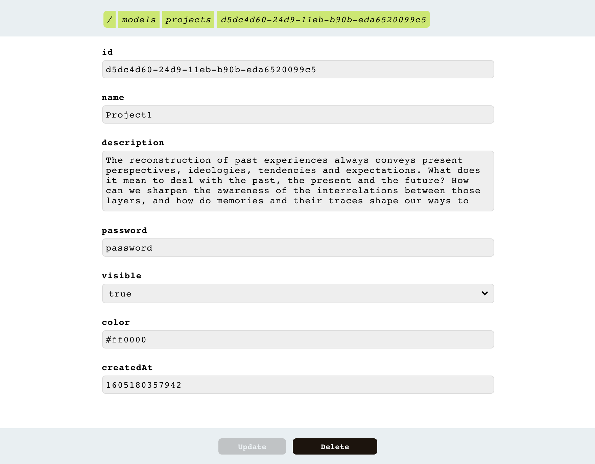

# node-data-editor
A customizable data editor for node, using JSON schema. By using custom Data Adapters, it can be connetced to a REST API or any other data provider.



Demo: [https://repl.it/@lutzer/Node-Data-Editor-Example](https://repl.it/@lutzer/Node-Data-Editor-Example)

## Install
```
npm install node-data-editor
```

## Usage

### Import

```javascript
import * as DataEditor from 'node-data-editor'
// or
const DataEditor = require('node-data-editor')
```

### Basic example

```javascript
const DataEditor = require('node-data-editor')

const initialData = [
  {
    id: '1',
    name: 'Peter',
    age: 20,
    siblings: ['Maria', 'Lea']
  }
]

DataEditor.start({
  models: [new DataEditor.DataModel({
    schema: {
      $id: 'Persons',
      properties: {
        id: { type: 'string', minLength: 1 },
        name: { type: 'string', minLength: 3 },
        address: { type: 'string', maxLength: 256 },
        siblings: { type: 'array' },
        married: { type: 'boolean', default: false },
        age: { type: 'number', default: 0 }
      },
      primaryKey: 'id',
      required: ['id'],
      titleTemplate: '<%= name %>:<%= age %>'
    },
    adapter: new DataEditor.MemoryAdapter(initialData, 'id')
  })],
  port: 3000
}).then((server) => { console.log('Editor is available on localhost:3000') })
```

#### Authentification
Adding a credential object to the editor will password protect its data and editing functions
```javascript
DataEditor.start({
  models: [...],
  port: 3000,
  credentials: {
    login: 'admin',
    password: 'password'
  }
}).then()
```


### Schema Description
The Schma definitions follow [JSON Schema](https://json-schema.org/). It needs to contain a primaryKey property of type string, itentified by the 'primaryKey' field. The Editor currently does not support nested properties, just the base Datatypes. It will validate nested properties though.

```typescript
// type DataType = 'string' | 'number' | 'boolean' | 'object' | 'array' | 'null'
{
  $id: string,
  properties: { [key : string] : {
    type : DataType
    default? : any
  }}
  primaryKey: string,
  required? : string[],
  titleTemplate? : string,
  links? : { model : string, key : string, foreignKey : string }[]
}
```


#### Schema Example

```javascript
var schema = {
  "$id": "Book",
  "properties": {
    "id": {
      "type": "string"
    },
    "author": {
      "type": "string",
      "default" : "John Doe"
    },
    "title": {
      "type": "string",
      "default" : "untitled"
    }
  },
  "primaryKey": "id",
  "required": [ "title" ]
}
```
#### Custom Title for data entry
By defining titleTemplate a custom title is displayed for each data entry in the data model using [lodash templates](https://lodash.com/docs/4.17.15#template).

```javascript
// example using titleTemplate. can be of style <%- name %> or ${name}
var schema = {
  $id: 'projects',
  properties: {
    id : { type: 'string' },
    name : { type: 'string' }
  },
  primaryKey: 'id',
  required : ['name', 'description', 'password'],
  titleTemplate: '${name}:${id}'
}
```

#### Linking Models
By defining a link property in the schema, an entry can be linked to other models by specifing a key and foreign Key to match entries:

```javascript
var schema1 = {
  $id : 'foo',
  properties: {
    id: { type: 'string' },
    text: { type : 'string' }
  },
  primaryKey : 'id',
  links : [ { model: 'bar', key: 'id', foreignKey: 'fooId' } ]
}
var schema2 = {
  $id : 'bar',
  properties: {
    id: { type: 'string' },
    fooId : { type : 'string' },
    text: { type : 'string' }
  },
  primaryKey : 'id',
}
```

### Data Adapter
The connection to a dataset/database works through the Adapter Interface. There are two implementations:

#### RestAdapter

```javascript
// connects to a standard REST api, using these endpoints: GET '/', GET '/:id', PUT '/:id', POST '/', DELETE '/:id'. The Options object is passed to the axios http calls.
const adapter = new RestAdapter(apiAddress, options)
```

#### MemoryAdapter

```javascript
// saves data in an simple array. does not persist data. first argument is the initial data array, second argument is the primary Key of the entries.
const adapter = new MemoryAdapter([], 'id')
```

#### Custom Adapter
The custom adapter needs to implement 5 Methods. See [src/adapter.ts](src/adapter.ts) MemoryAdapter or RestAdapter for example implementations. 'id' is the defined primaryKey of the schema.

```javascript
class CustomAdapter implements DataEditor.Adapter {
  list(): Promise<any[]> {
    // list all data entries of this resource
  }
  read(id: string): Promise<any|undefined> {
    // list one entry with the specified id
  }
  update(id: string, data: any): Promise<void> {
    // updates a single entry, specified by id
  }
  delete(id: string): Promise<void> {
    // deletes the specified entry
  }
  create(data: any): Promise<any> {
    // creates a new entry
  }
}
```

# Development
* run `npm install`
* run `npm run dev` to start test server
* run `npm run build` to start a full production build

## Unit Tests
* run `npm run test`

## Frontend Development
* see /frontend/ dir
* run `cd frontend; npm start` to run frontend dev server

## Troubleshooting

* node-sass currently requires a node version < 15